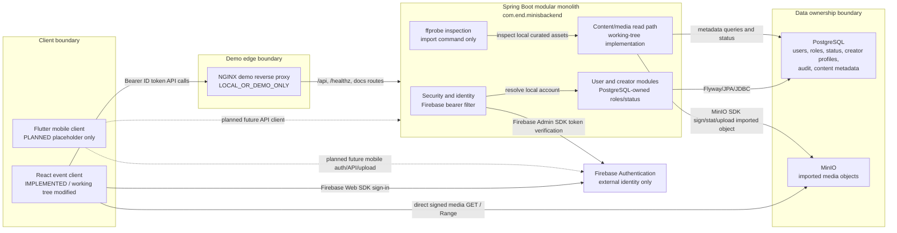

# Current Architecture Diagram

```mermaid
flowchart LR
  subgraph Clients["Client boundary"]
    React["React event client\nIMPLEMENTED / working tree modified"]
    Flutter["Flutter mobile client\nPLANNED placeholder only"]
  end

  subgraph DemoEdge["Demo edge boundary"]
    Nginx["NGINX demo reverse proxy\nLOCAL_OR_DEMO_ONLY"]
  end

  subgraph Backend["Spring Boot modular monolith\ncom.end.minisbackend"]
    Security["Security and identity\nFirebase bearer filter"]
    Users["User and creator modules\nPostgreSQL-owned roles/status"]
    Content["Content/media read path\nworking-tree implementation"]
    Probe["ffprobe inspection\nimport command only"]
  end

  subgraph DataStores["Data ownership boundary"]
    Postgres["PostgreSQL\nusers, roles, status, creator profiles,\naudit, content metadata"]
    Minio["MinIO\nimported media objects"]
  end

  Firebase["Firebase Authentication\nexternal identity only"]

  React -->|"Firebase Web SDK sign-in"| Firebase
  React -->|"Bearer ID token API calls"| Nginx
  React -->|"direct signed media GET / Range"| Minio
  Flutter -. "planned future mobile auth/API/upload" .-> Firebase
  Flutter -. "planned future API client" .-> Backend
  Nginx -->|"/api, /healthz, docs routes"| Backend
  Security -->|"Firebase Admin SDK token verification"| Firebase
  Security -->|"resolve local account"| Users
  Users -->|"Flyway/JPA/JDBC"| Postgres
  Content -->|"metadata queries and status"| Postgres
  Content -->|"MinIO SDK sign/stat/upload imported object"| Minio
  Probe -->|"inspect local curated assets"| Content
```
